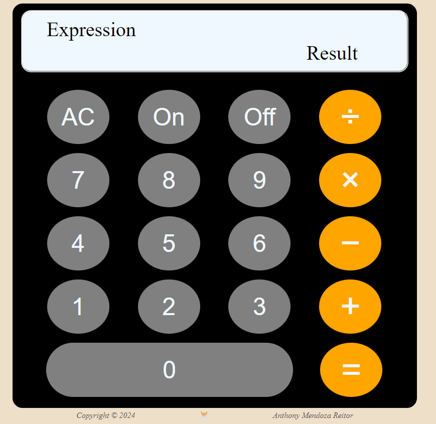

# Calculator Project

This is a simple calculator web application built with HTML, CSS, and JavaScript. The calculator performs basic arithmetic operations and has a user-friendly interface, designed as part of The Odin Project's Full Stack JavaScript path.

## Live Demo

Check out the live version of the calculator [here](https://anthony-mendoza-reitor.github.io/calculator-ToP/).

## Features

- **Basic Arithmetic Operations**: The calculator can perform addition, subtraction, multiplication, and division.
- **Power On/Off Functionality**: Users can turn the calculator on and off.
- **Clear (AC)**: Reset the calculator to its initial state.
- **Display**: Shows the current expression and result.

## Technologies Used

- **HTML**: For structuring the calculator interface.
- **CSS**: For styling and layout of the calculator components.
- **JavaScript**: For calculator logic, event handling, and interactions.

## Project Structure

- `index.html`: Contains the calculator layout and buttons.
- `style.css`: Defines the visual appearance of the calculator, including styles for buttons, display screen, and layout.
- `script.js`: Contains the calculator's core functionality, including operations, event listeners, and power management.

## Usage

1. **Power On/Off**: Use the "On" and "Off" buttons to power the calculator.
2. **Arithmetic Operations**: Press the operator buttons (`+`, `−`, `×`, `÷`) to set operations.
3. **Clear (AC)**: Resets the calculator's inputs and display.
4. **Equal (=)**: Calculates and displays the result of the expression.

## Code Overview

### HTML Structure

The calculator's HTML structure includes a display screen for the expression and result, and button elements for numbers and operators.

### JavaScript Functions

- **add(a, b)**: Returns the sum of `a` and `b`.
- **substract(a, b)**: Returns the difference between `a` and `b`.
- **multiply(a, b)**: Returns the product of `a` and `b`.
- **divide(a, b)**: Returns the quotient of `a` and `b`.
- **operate(a, b, operator)**: Determines which operation to perform based on the `operator`.

### CSS Styling

The calculator uses Flexbox for layout alignment, with a styled display and button grid layout to mimic a physical calculator interface.

## Author

Created by **Anthony Mendoza Reitor** as part of The Odin Project.

---

Enjoy using the calculator! Feel free to fork the repository, report issues, or contribute to its development.
